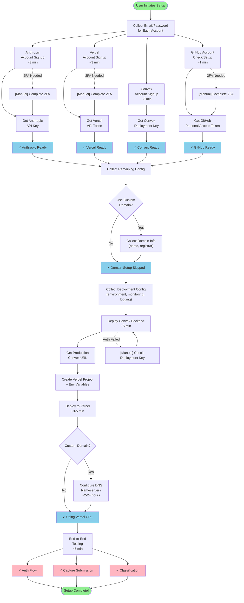

# Setup Task Dependency Graph

## Mermaid Diagram



---

## Dependency Matrix (Text Form)

| Task ID | Task Name                 | Duration | Depends On | Parallel With | Produces       | Notes                               |
| ------- | ------------------------- | -------- | ---------- | ------------- | -------------- | ----------------------------------- |
| 1.1     | Anthropic Account Signup  | 3 min    | None       | 1.2-1.4       | API Key        | Automated via Playwright            |
| 1.2     | Vercel Account Signup     | 3 min    | None       | 1.1,1.3,1.4   | API Token      | Automated via Playwright            |
| 1.3     | Convex Account Signup     | 3 min    | None       | 1.1,1.2,1.4   | Deployment Key | Automated via Playwright            |
| 1.4     | GitHub Token (PAT)        | 1 min    | None       | 1.1-1.3       | Access Token   | Automated via Playwright            |
| 2.1     | Domain Interrogation      | 3 min    | 1.1-1.4    | None          | Domain Config  | Conditional: only if custom domain  |
| 2.2     | Deployment Config         | 2 min    | 2.1        | None          | Env Vars       | Environment, monitoring, logging    |
| 3.1     | Deploy Convex Backend     | 5 min    | 1.3, 2.2   | None          | Convex URL     | Must happen before Vercel           |
| 4.1     | Create Vercel Project     | 2 min    | 1.2, 3.1   | None          | Project ID     | Needs Convex URL for env vars       |
| 4.2     | Deploy to Vercel          | 3-5 min  | 4.1        | None          | Live URL       | Auto-builds from repo               |
| 5.1     | Configure DNS (if custom) | 2-24 hrs | 2.1, 4.2   | None          | DNS Resolution | Manual: nameserver update (async)   |
| 6.1     | End-to-End Testing        | 5 min    | 4.2, 5.1   | None          | Validation     | Auth, capture, classification flows |

---

## Dependency Chain (Critical Path)

```
START
 ↓
Phase 1 (Parallel): Tasks 1.1, 1.2, 1.3, 1.4 → 10 min (done in parallel)
 ↓
Phase 2: Tasks 2.1, 2.2 → 5 min (sequential after Phase 1)
 ↓
Phase 3: Task 3.1 (Convex Deploy) → 5 min (blocker for Vercel)
 ↓
Phase 4: Task 4.1 (Vercel Project) → 2 min (needs Convex URL)
           ↓
          Task 4.2 (Vercel Deploy) → 5 min
 ↓
Phase 5: Task 5.1 (DNS Config) → 2-24 hours (async, optional)
 ↓
Phase 6: Task 6.1 (Testing) → 5 min (can start immediately after 4.2)
 ↓
SUCCESS

Total Critical Path: ~27-32 min (plus optional 2-24 hr DNS)
Parallelizable: 60% of time (Phase 1, partial Phase 2)
```

---

## Parallel Execution Windows (for Claude Code 6 Windows)

**Optimal distribution:**

```
Window 1: Anthropic Account Signup (1.1) → collect API Key
Window 2: Vercel Account Signup (1.2) → collect API Token
Window 3: Convex Account Signup (1.3) → collect Deployment Key
Window 4: GitHub PAT Generation (1.4) → collect Access Token
Window 5: Domain Config (2.1) & Deploy Config (2.2) → collect env vars
Window 6: Monitor Phase 1 completion → when all done, trigger Phase 3-4 sequentially
```

All Windows 1-4 complete independently and in parallel (~3-5 min total).
Window 5 can start immediately after Window 1-4 complete.
Window 6 waits for Phase 1, then orchestrates sequential deployment steps.

---

## Error Handling & Fallbacks

```
Phase 1 (Account Creation) Failures:
├─ If 2FA required:
│  └─ [MANUAL] Prompt user to complete 2FA in browser
│     └─ Retry task after 30 seconds
│
├─ If email already exists:
│  └─ [AUTO] Prompt user to use existing account
│     └─ Transition to token retrieval (1.x-key steps)
│
└─ If automation blocked (CAPTCHA, rate limit):
   └─ [MANUAL] Provide direct signup link, wait for user completion
      └─ Proceed to manual token collection

Phase 3 (Convex Deploy) Failures:
├─ If deployment fails:
│  └─ [AUTO] Check logs, display error message
│     └─ Allow user to fix and retry
│
└─ If credentials invalid:
   └─ [MANUAL] Verify deployment key in Convex dashboard
      └─ Update QuestionManager with correct key, retry

Phase 4 (Vercel Deploy) Failures:
├─ If env vars missing:
│  └─ [AUTO] Auto-populate from Phase 3 outputs
│     └─ Retry deployment
│
└─ If GitHub integration fails:
   └─ [MANUAL] User manually connects GitHub in Vercel dashboard
      └─ Proceed manually or retry automation

Phase 5 (DNS) Failures:
└─ DNS propagation delayed:
   └─ [ASYNC] Continue to Phase 6 testing on Vercel URL
      └─ User can update DNS anytime, DNS resolves when ready
```

---

## Decision Points

```
1. Custom Domain?
   YES → Include Task 2.1 (Domain Config)
   NO  → Skip Task 2.1, use Vercel default URL (https://[project].vercel.app)

2. GitHub OAuth for User Login?
   YES → Include GitHub OAuth app setup (part of Task 2.2)
   NO  → Use email/password only (simpler)

3. Monitoring & Logging?
   YES → Enable Vercel Analytics + Convex logs
   NO  → Minimal monitoring (faster setup)

4. Errors During Setup?
   RETRYABLE (2FA, rate limits, typos) → Offer retry with explanation
   NOT RETRYABLE (invalid credentials) → Clear error message, allow user to fix
   UNKNOWN → Offer manual option or support contact
```

---

## Timeline Scenarios

### Scenario A: Fully Automated, No Custom Domain

```
T+0:00   Phase 1 starts (4 parallel signups)
T+0:05   Phase 1 complete (all accounts + tokens collected)
T+0:10   Phase 2 complete (config collected)
T+0:15   Phase 3 complete (Convex deployed, URL received)
T+0:17   Phase 4.1 complete (Vercel project created)
T+0:22   Phase 4.2 complete (Frontend deployed)
T+0:27   Phase 6 complete (Testing validated)
TOTAL: ~27 minutes → LIVE 🎉
```

### Scenario B: Automated + Custom Domain

```
T+0:00   Phases 1-4 same as Scenario A → T+0:22
T+0:22   Phase 5 starts (user updates nameservers)
T+2-48h  DNS propagates (async, doesn't block user)
T+0:27   Phase 6 complete (testing on Vercel URL immediately)
TOTAL: 27 min to working app + 2-48h for DNS (optional)
```

### Scenario C: Manual 2FA Required

```
T+0:00   Phase 1 starts
T+0:03   Anthropic needs 2FA → [MANUAL] User completes in browser
T+0:05   Anthropic 2FA done → task retries
T+0:08   All signups complete
T+0:13   Phases 2-6 continue as normal
TOTAL: ~32 minutes (5 min delay for 2FA) → LIVE
```
